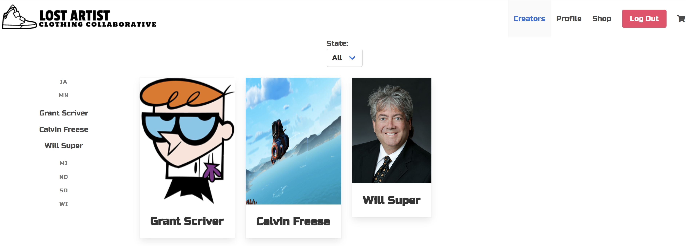

# Lost Artist
#### Table of Contents
  * [Description](#Description)
  * [Installation](#Installation)
  * [Technologies Used](#Technologies-Used)
  * [Steps](#Steps)
  * [Screenshot](#Screenshot)
  * [Credits](#Credits)
  * [License](#License)

## Description
Lost Artist Clothing Collaboration is a place where fashion designers from the upper midwest states - locations typically overlooked in the fashion community - can feature and sell their work. We give designers the ability to create profiles to share who they are, their experience, and a platform for shoppers to connect with them for potentially commissioned work, exposure, and a place to show support for their local designers and community.

Click [Here](/url/here) to view the deployed site.
 
## Installation
#### Technologies Used
* HTML/CSS/JavaScript
* [React](https://reactjs.org/)
* [Node](https://nodejs.org/en/) and [npm](https://www.npmjs.com/package/npm)
* [Visual Studio Code](https://code.visualstudio.com/)
* [auth0](https://auth0.com)
* [firebase](https://firebase.google.com/)
* [mySQL](https://www.mysql.com/)
* [Bulma](https://bulma.io/)
* [Stripe](https://stripe.com/)

#### Steps
1.  Start by entering the following in your terminal: `Git clone`

2.  Change directory to `Lost-Artist` and enter `npm install` into your terminal. This will install all package dependencies.

3.  Add node_modules to .gitignore.

4.  Start the application by running `npm start`

## Screenshot

## Credits

## License

[License](LICENSE)
MIT &copy; 2020 
